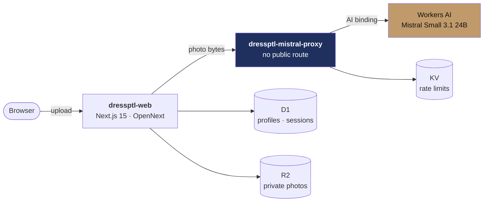

<div align="center">

# DressPTL

**Your colour profile, learned from what you already love.**

Upload photos of outfits you feel good in. DressPTL works out the colours — and
the colour *pairings* — you actually reach for, then suggests new looks built on
them.

[](https://github.com/thepatelbhai69/DressPTL/actions/workflows/ci.yml)
[](https://github.com/thepatelbhai69/DressPTL/actions/workflows/deploy.yml)

**[Live app →](https://dressptl-web.6mftcg72zn.workers.dev)**

</div>

---

## What it actually does

Most style tools ask what you like. This one reads it off your wardrobe.

1. **Upload** photos of outfits you already wear.
2. A vision model extracts the **garments and colours**, with each colour's
   prominence in the look.
3. Colours are snapped to a wardrobe palette in **CIELAB space** — perceptual
   distance, so navy doesn't collapse into black the way naive RGB matching
   does.
4. Weights accumulate with a **recency half-life**, so what you wore last month
   counts for more than last year.
5. **Co-occurrence within each outfit** is tracked separately from raw
   frequency — that's how it learns you pair camel *with* burgundy, not just
   that you own both.
6. Recommendations extend that palette instead of replacing it.

The colour engine is pure, dependency-free, and the most thoroughly tested part
of the codebase — it's the actual product, not the LLM call.

## Architecture



The proxy Worker is deployed with `workers_dev = false` and **no route**, so it
has no public URL at all. The web app reaches it only over a **service
binding** — an internal RPC channel — authenticated with a shared secret. The
proxy never touches R2 or D1: it takes bytes and returns JSON, so compromising
it exposes inference, not user data.

### Inference providers

| `AI_PROVIDER` | Backend | Credentials |
|---|---|---|
| **`workers-ai`** *(default)* | `@cf/mistralai/mistral-small-3.1-24b-instruct` — vision-capable, so one model covers analysis *and* generation | **None.** Account-scoped binding, free daily allocation |
| `mistral-api` | Pixtral Large / Mistral Large on `api.mistral.ai` | `MISTRAL_API_KEY` as a Worker secret |

On the default path there is **no API key anywhere in the system** — the `AI`
binding is only usable from inside a Worker on the owning account, which
removes the whole "key leaked into a bundle, a log, or a repo" class of
problem rather than managing it.

## Privacy

The original concept included inferring ethnicity from photos. That was
**dropped deliberately** — it's protected-class classification with real bias,
fairness, and biometric-privacy-law exposure, for very little product value.

Instead the app derives **skin undertone** (warm / cool / neutral), which is
what colour matching actually needs. Enforced in four independent places, not
merely intended:

| Layer | Mechanism |
|---|---|
| Prompt | Explicitly forbids ethnicity, race, nationality, age, gender, religion, disability |
| Schema | Zod `.strict()` — unexpected keys fail the parse |
| Guardrail | `assertNoSensitiveFields` deep-scans **raw** model output and fails closed with a 422, before Zod coerces it and before anything is stored — with no retry, since asking again invites the same violation |
| Storage | No column exists for any of it |

Photos are private to the account and streamed through an authenticated route
rather than a shareable URL. Deleting your account removes every R2 object and
every row.

## Tech stack

| Layer | Choice | Why |
|---|---|---|
| Web | Next.js 15 App Router on **Workers** via OpenNext | Cloudflare's current path for Next.js; `next-on-pages` is superseded |
| Inference | Workers AI (Mistral Small 3.1) | Vision + text in one model, no key to manage |
| Database | D1, plain SQL migrations | An ORM's indirection would cost more than it saves at this size |
| Photos | R2, private | Streamed through an authed route — presigned URLs need S3 credentials a binding doesn't have |
| Sessions | D1 table, PBKDF2 via Web Crypto | Enumerable, so account deletion genuinely cascades; bcrypt/argon2 need native bindings Workers lacks |
| Rate limits | KV | TTL semantics fit a fixed-window counter |

> **Why not GitHub Pages?** Pages serves static files only. Every route here is
> `force-dynamic` and needs D1, R2, KV, and a service binding at request time —
> even `/` redirects on the session cookie. There is no static subset to split
> out.

## Project structure

```
apps/web/               Next.js app — pages, API routes, auth, data layer
workers/mistral-proxy/  Inference proxy — the only component that talks to a model
packages/shared/        Colour science, profile aggregation, Zod contracts, prompts
scripts/                Secret scanner, inference verifier
```

## Local development

All three Cloudflare resources are provisioned and their IDs are committed, so
there is nothing to configure:

| Resource | Name | ID |
|---|---|---|
| D1 | `dressptl` | `4105c84b-5cf8-4361-81b8-d6e8f2a1e349` |
| KV | `dressptl-rate-limit` | `2a71eb53a6354eafa214c71c6e21368a` |
| R2 | `dressptl-photos` | — |

```bash
pnpm install

cd apps/web
pnpm db:migrate:local
cp .dev.vars.example .dev.vars
```

Run the whole app with **no inference at all** by setting `MISTRAL_STUB=1` on
the proxy. It returns deterministic analyses derived from the image bytes —
enough to exercise palette learning, blend detection, and recommendations end
to end without spending a single Neuron.

```bash
# Terminal 1 — proxy
cd workers/mistral-proxy && MISTRAL_STUB=1 npx wrangler dev

# Terminal 2 — web app
cd apps/web && pnpm dev
```

## Deployment

Pushes to `main` deploy automatically via
[`deploy.yml`](.github/workflows/deploy.yml): D1 migrations → proxy → web app,
in that order, because the web Worker's service binding can't resolve until the
proxy exists. A smoke test then asserts the deployed URL actually renders.

**Repository secrets** (Settings → Secrets and variables → Actions):

| Secret | Where |
|---|---|
| `CLOUDFLARE_ACCOUNT_ID` | Dashboard → Workers & Pages → right sidebar |
| `CLOUDFLARE_API_TOKEN` | My Profile → API Tokens → *Edit Cloudflare Workers* + **D1: Edit** |

**Worker secrets** — set once, persist across deploys, so they stay out of CI:

```bash
npx wrangler login
cd workers/mistral-proxy && npx wrangler secret put PROXY_SHARED_SECRET
cd ../../apps/web      && npx wrangler secret put PROXY_SHARED_SECRET  # same value
```

<details>
<summary>Manual deploy</summary>

```bash
cd workers/mistral-proxy && npx wrangler deploy   # proxy first
cd ../../apps/web && pnpm db:migrate && pnpm run deploy:cf
```

Note `pnpm run deploy:cf`, not `pnpm deploy` — `deploy` is a built-in pnpm
command that silently shadows package scripts of the same name.

</details>

## Checks

```bash
pnpm test               # 89 unit tests
pnpm typecheck
pnpm build
pnpm check:no-secrets   # fails if a credential reaches shipped output
```

Before deploying, or after changing `WORKERS_AI_MODEL`, verify the model
actually accepts our multimodal payload:

```bash
export CLOUDFLARE_ACCOUNT_ID=... CLOUDFLARE_API_TOKEN=...
node scripts/verify-inference.mjs           # --dry-run to skip the API call
```

It sends a generated solid-navy PNG and asks the model to name the colour,
which distinguishes *"the payload shape was accepted"* from *"the model
actually saw the image"*.

## Licence

Unlicensed — private project.
